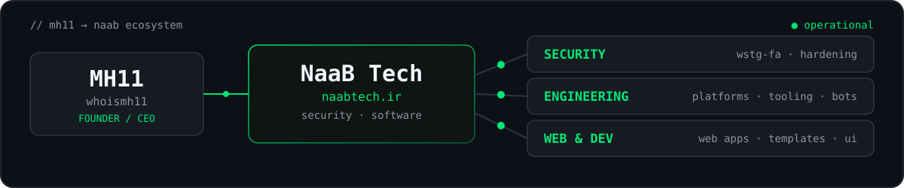

<p align="center">
  
</p>

<p align="center">
  <b>Cybersecurity · Software &amp; Web Development · Networks</b>
  <br />
  <sub>Founder &amp; CEO of <a href="https://naabtech.ir">NaaB Tech</a> — I break web apps (legally), harden them, and ship software around them.</sub>
</p>

<p align="center">
  <a href="https://mh11.ir"></a>
  <a href="https://naabtech.ir"></a>
  <a href="https://linkedin.com/in/whoismh11"></a>
  <a href="https://instagram.com/whoismh11"></a>
  <a href="assets/cv.pdf"></a>
</p>

## `$ whoami`

```bash
$ whoami
MH11 — Mohammad Hadadpour

$ focus --current
[ok] web-security      # OWASP WSTG Persian translation, app hardening
[ok] software          # web platforms, tooling, automation
[ok] web-development   # full-stack build, interfaces, templates
[ok] game-servers      # MTA:SA, Plutonium, TeknoMW3 engineering
[ok] systems & linux   # infra, networks, self-hosting
```

Offense-informed defense, shipped as real software and interfaces: a security knowledge base for Persian-speaking testers next to full game-server platforms, production tooling, and hand-built web front-ends — personal R&D under my own ecosystem, **NaaB Tech**.

## `$ ls ~/flagship`

- **[OWASP WSTG (fa-IR)](https://github.com/whoismh11/owasp-wstg-fa)** — official Persian translation of the OWASP Web Security Testing Guide, listed upstream (26+ stars, 4+ forks)
- **[MTA NaaB:RPG](https://github.com/whoismh11/mta-naabrpg-gamemode)** — complete Persian GTA:SA role-play server: MySQL, jobs, banking, VIP, admin panel (12+ stars, 7+ forks)
- **[Tournaments Template](https://github.com/whoismh11/tournaments-template)** — tournament site template with Name Picker and Team Generator web apps (8+ stars)
- **[PlutoT6 Scripts](https://github.com/whoismh11/plutot6-scripts)** — GSC scripts for Plutonium T6 (BO2) game servers (6+ stars)

## `$ cat ./arsenal`

<p align="center">
  
</p>

- **Security & Systems** — `OWASP` `Linux` `Bash` `Apache` `Git`
- **Web Development & Design** — `HTML/CSS` `JavaScript` `jQuery` `PHP` `MySQL` `Node.js`
- **Software Engineering** — `Python` `C` `C#` `Lua` `Pawn` `GSC`
- **Game Servers & Lab** — `MTA` `Plutonium` `TeknoMW3` `SA-MP` `Jupyter`

## `$ find ./work`

| Domain | Selected work |
| --- | --- |
| Security | [.htaccess](https://gist.github.com/whoismh11/e1092cc584297a6c01c7d00961721d24) Apache hardening · [No Inspect](https://gist.github.com/whoismh11/0411cf05fb852e8112354151fbc2ba90) client-side deterrent (+ OWASP WSTG in flagship) |
| Engineering | [Retro Design](https://github.com/whoismh11/retro-design-template) site template · [Smoke](https://github.com/whoismh11/smoke-template) lightweight template · [Dark Mode](https://gist.github.com/whoismh11/8575584bb25cd052ff7920f910c779d9) one-line CSS · [ParsVT Checker](https://github.com/ParsVT/requirements-checker) CRM preflight · [ParsVT Installer](https://github.com/ParsVT/linux-installer) deploy automation · [Discord](https://github.com/whoismh11/discord-bot) / [Twitch](https://github.com/whoismh11/twitch-bot) bots (+ Tournaments in flagship) |
| Game servers | [PlutoIW5](https://github.com/whoismh11/plutoiw5-scripts) MW3 scripts · [TeknoMW3](https://github.com/whoismh11/teknomw3-adminmodes) C# admin modes · [SA-MP Mapping](https://github.com/whoismh11/samp-mapping) map edits (+ MTA:RPG, PlutoT6 in flagship) |
| Lab | [Computer Vision](https://github.com/whoismh11/computer-vision) experiments · [Microprocessor Lab](https://github.com/whoismh11/microprocessor-lab) low-level C |
| Archive | [SMS Bomber](https://github.com/whoismh11/sms-bomber) legacy experiment, kept for history |

## `$ systemctl status mh11`

<p align="center">
  
</p>
<p align="center">
  <picture>
    <source media="(prefers-color-scheme: dark)" srcset="https://raw.githubusercontent.com/whoismh11/whoismh11/output/github-snake-dark.svg" />
    
  </picture>
</p>

## `$ cat /etc/naab`

<p align="center">
  
</p>

**NaaB Tech** ([naabtech.ir](https://naabtech.ir)) is my cybersecurity and software company. This profile is personal R&D — production ships under NaaB.

## `$ cat ./contact`

[mh11.ir](https://mh11.ir) · [naabtech.ir](https://naabtech.ir) · [LinkedIn](https://linkedin.com/in/whoismh11) · [Instagram](https://instagram.com/whoismh11) · [YouTube](https://youtube.com/@whoismh11) · [CV](assets/cv.pdf)

```text
[root@mh11 ~]# exit
logout — connection to mh11 closed.
```
