<p align="center">
  
</p>

<p align="center">
  <b>Cybersecurity · Software Engineering · AI · Networks</b>
  <br />
  <sub>Founder &amp; CEO @ <a href="https://www.linkedin.com/company/naabtech">NaaB Tech</a> — I break web apps (legally), harden them, and ship software around them.</sub>
</p>

<p align="center">
  <a href="https://mh11.ir"></a>
  <a href="https://linkedin.com/in/whoismh11"></a>
  <a href="https://youtube.com/@whoismh11"></a>
  <a href="https://instagram.com/whoismh11"></a>
  <a href="https://discord.gg/2JjvhAk"></a>
  <a href="https://www.linkedin.com/company/naabtech"></a>
  <a href="assets/cv.pdf"></a>
</p>

<p align="center">
  
  
</p>

## `$ whoami`

```bash
$ whoami
MH11 — Mohammad Hadadpour

$ focus --current
[✔] web-security      # OWASP WSTG Persian translation, app hardening
[✔] software          # web platforms, tooling, automation
[✔] game-servers      # MTA:SA, Plutonium, TeknoMW3 engineering
[✔] networks & linux  # infra, deployment, self-hosting
[...] ai               # computer-vision lab, loading…
```

I operate at the intersection of **offense-informed defense and shipping real software**: the most-starred work here is a security knowledge base for Persian-speaking testers, sitting next to full game-server platforms and production web tooling — all maintained under my own ecosystem, **NaaB Tech**.


## `$ ls ~/featured --top`

<table>
  <tr>
    <td width="50%" valign="top">
      <b><a href="https://github.com/whoismh11/owasp-wstg-fa">OWASP WSTG (fa-IR)</a></b> <sub>★ 26 · ⑂ 4</sub>
      <br />
      <sub>The official Persian translation of the OWASP Web Security Testing Guide — listed in the upstream project. 500+ commits of security knowledge, in Farsi.</sub>
      <br />
      <sub><code>security</code> <code>pentest</code> <code>owasp</code> <code>docs-fa</code></sub>
      <br />
      <sub><a href="https://github.com/whoismh11/owasp-wstg-fa">repo</a> · <a href="https://owasp.org/www-project-web-security-testing-guide">upstream</a></sub>
    </td>
    <td width="50%" valign="top">
      <b><a href="https://github.com/whoismh11/mta-naabrpg-gamemode">MTA NaaB:RPG Gamemode</a></b> <sub>★ 12 · ⑂ 7</sub>
      <br />
      <sub>Full-featured Persian GTA:SA (MTA) role-play server: MySQL persistence, jobs, banking, housing, VIP tiers, admin panel. A complete multiplayer product.</sub>
      <br />
      <sub><code>lua</code> <code>mysql</code> <code>mta:sa</code></sub>
      <br />
      <sub><a href="https://github.com/whoismh11/mta-naabrpg-gamemode">repo</a></sub>
    </td>
  </tr>
  <tr>
    <td width="50%" valign="top">
      <b><a href="https://github.com/whoismh11/tournaments-template">Tournaments Template</a></b> <sub>★ 8</sub>
      <br />
      <sub>Tournament operations platform template — brackets plus two working web apps: Random Name Picker and Random Team Generator.</sub>
      <br />
      <sub><code>html</code> <code>css</code> <code>js</code> <code>jquery</code></sub>
      <br />
      <sub><a href="https://github.com/whoismh11/tournaments-template">repo</a></sub>
    </td>
    <td width="50%" valign="top">
      <b><a href="https://github.com/whoismh11/plutot6-scripts">PlutoT6 Scripts</a></b> <sub>★ 6</sub>
      <br />
      <sub>Script collection for Plutonium T6 (Black Ops 2) dedicated servers — gameplay mods and server-side utilities.</sub>
      <br />
      <sub><code>gsc</code> <code>plutonium</code> <code>cod</code></sub>
      <br />
      <sub><a href="https://github.com/whoismh11/plutot6-scripts">repo</a></sub>
    </td>
  </tr>
</table>

## `$ cat ./arsenal`

<p align="center">
  
</p>

- **Security & Systems** — `OWASP` `Linux` `Bash` `Apache / .htaccess` `Git`
- **Languages** — `Python` `C` `C#` `Lua` `Pawn` `GSC` `PHP` `JavaScript`
- **Web & Data** — `HTML` `CSS` `jQuery` `Node.js` `MySQL`
- **AI / Lab** — `Python` `Jupyter Notebook` `Computer Vision` *(active learning track)*
- **Game Servers** — `MTA:SA` `Plutonium T6/IW5` `TeknoMW3` `SA-MP`

> No badge salad: everything above is backed by a repo or gist on this profile.


## `$ find ./work -maxdepth 2 -type f`

**Security & hardening**
- **[OWASP WSTG (fa-IR)](https://github.com/whoismh11/owasp-wstg-fa)** — official Persian translation of the OWASP testing guide ⬆ featured
- **[.htaccess Security](https://gist.github.com/whoismh11/e1092cc584297a6c01c7d00961721d24)** — Apache hardening config `apache`
- **[No Inspect](https://gist.github.com/whoismh11/0411cf05fb852e8112354151fbc2ba90)** — client-side deterrent snippet `javascript`

**Web engineering**
- **[Tournaments Template](https://github.com/whoismh11/tournaments-template)** — tournament platform + picker/generator apps ⬆ featured
- **[Retro Design Template](https://github.com/whoismh11/retro-design-template)** — full website template `html · css · js · php`
- **[Smoke Template](https://github.com/whoismh11/smoke-template)** — lightweight site template `html · css`
- **[Dark Mode](https://gist.github.com/whoismh11/8575584bb25cd052ff7920f910c779d9)** — one-line CSS dark mode `css`
- **[ParsVT Requirements Checker](https://github.com/ParsVT/requirements-checker)** — CRM preflight checker `php` *(org)*

**Game-server engineering**
- **[MTA NaaB:RPG](https://github.com/whoismh11/mta-naabrpg-gamemode)** ⬆ featured · **[PlutoT6 Scripts](https://github.com/whoismh11/plutot6-scripts)** ⬆ featured
- **[PlutoIW5 Scripts](https://github.com/whoismh11/plutoiw5-scripts)** — Plutonium IW5 (MW3) scripts `gsc`
- **[TeknoMW3 Adminmodes](https://github.com/whoismh11/teknomw3-adminmodes)** — MyAdmin / NaaBAdmin advanced admin modes `c#`
- **[SA-MP Mapping](https://github.com/whoismh11/samp-mapping)** — GTA:SA map edits `pawn`

**Automation & infra**
- **[ParsVT Linux Installer](https://github.com/ParsVT/linux-installer)** — CRM install automation `bash · php` *(org)*
- **[Discord Bot](https://github.com/whoismh11/discord-bot)** · **[Twitch Bot](https://github.com/whoismh11/twitch-bot)** — community bots `node.js`

**Lab & learning**
- **[Computer Vision](https://github.com/whoismh11/computer-vision)** — CV experiments `python · jupyter`
- **[Microprocessor Lab](https://github.com/whoismh11/microprocessor-lab)** — low-level examples `c`

**Archive**
- **[SMS Bomber](https://github.com/whoismh11/sms-bomber)** — legacy OTP-sending experiment, kept for history `python`


## `$ systemctl status mh11 --live`

<p align="center">
  
  
</p>
<p align="center">
  
</p>
<p align="center">
  <picture>
    <source media="(prefers-color-scheme: dark)" srcset="https://raw.githubusercontent.com/whoismh11/whoismh11/output/github-snake-dark.svg" />
    
  </picture>
</p>

## `$ cat ./ecosystem`

> **MH11 → NaaB Tech.** Personal R&D and open source live here; production work ships under **[NaaB Tech](https://www.linkedin.com/company/naabtech)** (Founder & CEO). The same roots grew **[NaaB Clan](https://naabclan.ir)** (gaming community, est. 2013) and the GAMEGG tournament tooling featured above.

## `$ cat ./contact`

```bash
$ cat ./contact
website ...... https://mh11.ir
linkedin ..... https://linkedin.com/in/whoismh11
discord ...... https://discord.gg/2JjvhAk
youtube ...... https://youtube.com/@whoismh11
instagram .... https://instagram.com/whoismh11
cv ........... assets/cv.pdf
```

Best first contact: **LinkedIn** or **Discord**. Security disclosures and collaboration proposals welcome.

<!-- MH11 · EOF -->
<p align="center"><sub>root@mh11:~# exit — <code>whoismh11</code> · Shahin Shahr / Isfahan · <a href="https://mh11.ir">mh11.ir</a></sub></p>
